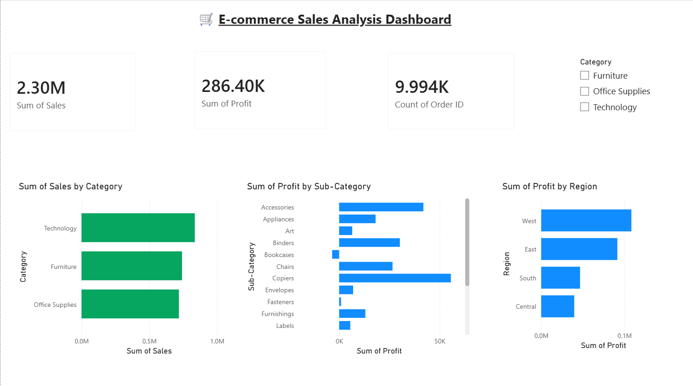

# 🛒 E-commerce Sales Analysis — Superstore Dataset

## 📌 Project Overview
Analyzing 4 years of retail sales data (2014–2017) across 
product categories, regions, and customer segments to generate 
actionable business insights for a superstore.

## 🛠️ Tools Used
- Python (pandas, numpy, matplotlib, seaborn)
- Power BI Desktop
- SQL
- Google Colab
- GitHub

## 📊 Dashboard Preview


## 🔍 Key Business Findings
- **Technology** leads with 17.4% profit margin — best category
- **Furniture** has only 2.49% margin despite $742K sales — red flag
- **Binders, Tables, Machines** are top 3 loss makers (combined -$100K)
- **Discounts above 30%** almost always result in negative profit
- **West region** is most profitable with $108K profit
- **Q4 seasonality** — sales spike every November-December
- **Home Office** segment delivers best profit margin at 14.03%

## 💡 Business Recommendations
- Cap discounts at 20% maximum to protect profitability
- Review Furniture pricing strategy urgently
- Focus marketing on Technology products — highest ROI
- Invest more in West region marketing
- Target Home Office customers for premium products

## 📁 Project Structure
```
ecommerce-sales-analysis/
│
├── Ecommerce_Sales_Analysis.ipynb    # Main analysis notebook
├── superstore_sql_analysis.sql       # 10 SQL queries
├── Sample - Superstore.csv           # Dataset
├── Ecommerce_Sales_Dashboard.pbix    # Power BI dashboard
├── ecommerce_dashboard.png           # Dashboard screenshot
├── category_analysis.png             # Chart 1
├── region_analysis.png               # Chart 2
├── monthly_trend.png                 # Chart 3
├── loss_makers.png                   # Chart 4
├── discount_profit.png               # Chart 5
├── segment_margin.png                # Chart 6
└── README.md
```

## 📈 Analysis Highlights

### Category Performance
| Category | Sales | Profit | Margin % |
|---|---|---|---|
| Technology | $836K | $145K | 17.4% |
| Furniture | $742K | $18K | 2.49% |
| Office Supplies | $719K | $122K | 17.04% |

### Regional Performance
| Region | Sales | Profit |
|---|---|---|
| West | $725K | $108K |
| East | $678K | $91K |
| Central | $501K | $39K |
| South | $391K | $46K |

## ⚠️ Data Limitations
- US-only dataset — insights may not apply to Indian market
- Data from 2014–2017 — trends may have shifted post-COVID

## 👩‍💻 Author
Rekha Shida | Computer Engineering | Parul University
GitHub: github.com/rekhashida
LinkedIn: linkedin.com/in/rekha-sida-rs576
